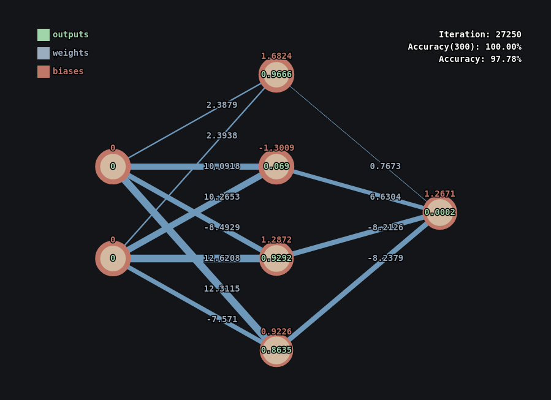

# Neural Network Visualizer

A work-in-progress project, aimed to display through a GUI the neural network learning process.
This 'vanilla' model was initially inpired by the series "10: Neural Networks - The Nature of Code", by the professor Daniel Shiffman.

This model though, implements unconventional abstractions for the sole purpose of graphical rendering, in the expense of computational efficiency.

